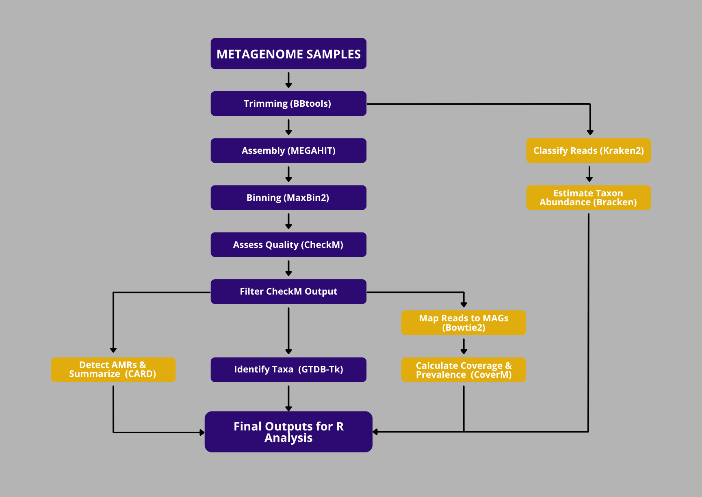

# Metagenome Pipeline
Current version: v1.0.0 (core + optional extensions)

This repository contains a **reproducible, script-based pipeline** for processing paired-end FASTQ files through read-level community profiling, assembly, binning, MAG quality control, read mapping, prevalence estimation, taxonomy assignment, AMR identification, and quality-tier splitting.

The pipeline has been validated using the software versions specified in the setup scripts. 
Newer versions of individual tools may work but have not been tested with this release.

It is designed so that:

* **On an already configured VM**: create a project and copy the `config.sh` and `run.sh` templates.
* **On an unconfigured VM**: you run a one-time setup (tools + environments), then run the same pipeline scripts unchanged.

---

## 1. Pipeline overview



### Order of execution:

1. **Trimming** – BBTools (BBDuk)
2. **Community profiling (optional)** – Kraken2 + Bracken
3. **Assembly** – MEGAHIT (Minimum contig length = 1000)
4. **Binning** – MaxBin2
5. **Quality control** – CheckM
6. **Usable MAG filtering** (≥50% completeness, ≤10% contamination)
7. **Taxonomy** – GTDB-Tk (run once on usable MAGs)
8. **Mapping & Prevalence Estimation (optional)** – Bowtie2 + CoverM 
9. **AMR Identification (optional)** - CARD

Users interested only in MAG recovery and taxonomy can disregard optional steps.
All steps are logged and restart safe.

## 2. Directory structure

```
ROOT/
├── tools/          			# shared software and environments
├── scripts/        			# shared pipeline scripts
├── setup/          			# bootstrap, verify, setup_user_envs
├── base-per-project-scripts/ 	# per-project templates copied when creating a new project
└── USER_ID/
    └── PROJECT/                # each project lives in a single directory
		├──10mapping/
		│   ├── bowtie2/
		│   ├── coverage/
		│   └── prevalence/
		├── 11kraken2/ 
		│ 	├── reports/ 
		│ 	├── outputs/ 
		│ 	├── bracken/ 
		│ 	└── summary/
		├── 1raw/
		├── 2trimmed/
		├── 3megahit/
		├── 4maxbin2/
		├── 5checkm_bins/
		├── 6checkm/
		├── 7usable_mags/
		├── 7high_quality_mags/
		├── 7near_high_mags/
		├── 7near_medium_mags/
		├── 7medium_mags/
		├── 8gtdbtk/
		├── 9card_rgi/
		├── logs/
		├── config.sh
		└── run.sh
```

---

## 3. FASTQ input requirements

Paired-end reads **must** be named:

```
*_R1.fastq.gz
*_R2.fastq.gz
```

By default, place FASTQ files in:

```
1raw/
```

If your FASTQ files are already stored elsewhere and you do not want to move them, edit `RAW_DIR` in the project's `config.sh`.

Change:

```bash
RAW_DIR="$BASE/1raw"
```

To the full path containing your FASTQ files, for example:

```bash
RAW_DIR="/path/to/your/fastqs"
```

The FASTQ naming and format requirements still apply.

---

## 4. Running the pipeline

If you are using this pipeline on your VM for the first time, complete the one-time setup in Section 5 before running the pipeline.

If your VM has previously been configured for this pipeline, the required tools may already be installed.
You will still need to complete Sections 5.2 and 5.6 for each new project.

From inside the Project directory (where `config.sh` and `run.sh` live):
```bash
chmod +x *.sh

# Core MAG reconstruction
./run.sh trim

# Optional: read-level community profiling 
# Can be run after ./run.sh trim 
./run.sh kraken2
./run.sh kraken_summary
# Optional: generate Bracken abundance estimates at an additional taxonomic rank from existing Kraken2 reports
./run.sh bracken_rank P

#The core MAG workflow can continue independently with:
./run.sh assemble
./run.sh maxbin
./run.sh checkm
./run.sh usable
./run.sh gtdbtk
./run.sh split

# Optional: MAG prevalence estimation
# Can be run at any point after ./run.sh usable
./run.sh map
# Re-run after mapping to add prevalence data to the tier summary tables
./run.sh split

# Optional: AMR annotation
./run.sh card
./run.sh card_summary

```
**Run one at a time.**

Optional (advanced): override variables at runtime

```bash
ROOT=/data/Metagenome-pipeline USER_ID=yourname PROJECT=test ./run.sh trim 
```

Use `screen` or `tmux` for long steps.
Ensure ≥500 GB free disk space for large projects.

---

## 5. Running on a different VM

### Tested software versions

This pipeline was developed and tested with the following primary software versions:

| Software                  | Version |
|---------------------------|---------|
| BBTools                   | 39.33   |
| MEGAHIT                   | 1.2.9   |
| MaxBin2                   | 2.2.7   |
| Perl (MaxBin2 environment)| 5.32.1  |
| CheckM                    | 1.2.4   |
| GTDB-Tk                   | 2.6.1   |
| GTDB reference data       | R226    |
| Kraken2                   | 2.17.1  |
| Bracken                   | 3.1     |
| Kraken2/Bracken database  | Standard-16 (2026-06-26) |
| Bowtie2                   | 2.5.5   |
| SAMtools                  | 1.23.1  |
| CoverM                    | 0.7.0   |
| RGI                       | 6.0.5   |
| CARD database             | 3.2.7   |

These versions are pinned in the setup scripts where applicable. Newer
versions may work, but have not been validated with this pipeline.

### 5.0 Clone the repository

Choose where you want the pipeline repository to live. The cloned repository directory will be used as `ROOT`.

For example:

```bash
mkdir -p /labfiles/pipelines
cd /labfiles/pipelines

git clone <repository-url> Metagenome-pipeline
cd Metagenome-pipeline
```

After cloning, the directory should contain:
	
```
Metagenome-pipeline/
├── scripts/
├── setup/
├── base-per-project-scripts/
├── README.md
├── LICENSE
└── ...
```

In each project's copied `config.sh`, set ROOT to the full path of this cloned repository, for example:

```
ROOT="${ROOT:-/labfiles/pipelines/Metagenome-pipeline}"
```

### 5.1 Bootstrap tools and environments

From the `setup/` directory:

```bash
bash bootstrap.sh
```

This installs (in `tools/`):

* micromamba
* BBTools
* MEGAHIT (v1.2.9)
* micromamba environments:

  * `kraken2_env`
  * `maxbin_env`
  * `checkm_env`
  * `mapping_env`
  * `gtdbtk_env`
  * `rgi_env`
  

### 5.2 Per-user setup

From the `ROOT/` directory:

```bash
cd /path/to/Metagenome-pipeline

mkdir -p firstnamelastinitial/projectname
cd firstnamelastinitial/projectname

cp /path/to/Metagenome-pipeline/base-per-project-scripts/config.sh .
cp /path/to/Metagenome-pipeline/base-per-project-scripts/run.sh .
```

Edit the copied `config.sh`:

```bash
ROOT="${ROOT:-/path/to/Metagenome-pipeline}"
USER_ID="${USER_ID:-firstnamelastinitial}"
PROJECT="${PROJECT:-projectname}"
```
Do not edit the template at:
	
```
/path/to/Metagenome-pipeline/base-per-project-scripts/config.sh
```

bootstrap.sh creates shared path-based environments under TOOLS_ROOT. 
If shared environments are unavailable or a user does not have permission to use them, 
the user can instead create named, user-owned micromamba environments:

```bash
./run.sh setup-user
```

The execution scripts automatically detect either type of micromamba environments.

### 5.3 GTDB-Tk reference data

This pipeline pins **GTDB-Tk v2.6.1** and uses **GTDB release R226** to provide a reproducible and compatible taxonomic classification environment.
Using a different GTDB-Tk or GTDB reference-data release may require changes to the environment or pipeline configuration and has not been validated with this pipeline release.
The GTDB-Tk reference-data download, extraction, and classification steps can be large and long-running. 
Use `screen` or `tmux` when appropriate and confirm sufficient storage before starting.

#### Download R226

Create the GTDB-Tk reference data directory:

```bash
mkdir -p /path/to/Metagenome-pipeline/tools/gtdbtk
cd /path/to/Metagenome-pipeline/tools/gtdbtk
```

Download the R226 GTDB-Tk reference data archive:

```bash
wget https://data.ace.uq.edu.au/public/gtdb/data/releases/release226/226.0/auxillary_files/gtdbtk_package/full_package/gtdbtk_r226_data.tar.gz
```

If the primary download server is unavailable, the GTDB data repository can be used as an alternative source for release R226.

#### Verify the download before extraction

```bash
echo "24b476ea5a4ef30519d461e56cc4a27f  gtdbtk_r226_data.tar.gz" | md5sum -c -
```

A successful download should return:

```
gtdbtk_r226_data.tar.gz: OK
```

#### Extract R226

Create the final reference data directory and extract the archive:

```bash
mkdir -p /path/to/Metagenome-pipeline/tools/gtdbtk/release226

tar -xvzf gtdbtk_r226_data.tar.gz \
  -C /path/to/Metagenome-pipeline/tools/gtdbtk/release226 \
  --strip-components=1
```

Confirm that the reference data were extracted:

```bash
ls /path/to/Metagenome-pipeline/tools/gtdbtk/release226
```

The directory should contain multiple GTDB-Tk database files and subdirectories.

### 5.4 Kraken2 and Bracken reference database

Kraken2 requires a reference database for read-level taxonomic classification. 
Bracken uses the same database but additionally requires a k-mer distribution file corresponding to the sequencing read length.

This Pipeline was tested using the Standard-16 Kraken2/Bracken database released June 26, 2026, available from the Langmead Lab prebuilt Kraken2 database repository.
The Standard-16 database contains RefSeq archaea, bacteria, viral, plasmid, human, and UniVec_Core sequences, with the Kraken2 database capped at 16 GB during construction. 
The June 26, 2026 archive is approximately 11.2 GB and produces an approximately 14.9 GB Kraken2 index after extraction.

The prebuilt package also includes Bracken support files for multiple read lengths, including the 150 bp reads used by default in this pipeline.

#### Download Standard-16

Create the database directory:

```bash
mkdir -p /path/to/Metagenome-pipeline/tools/kraken2_db_prebuilt 
cd /path/to/Metagenome-pipeline/tools/kraken2_db_prebuilt
```

Download the tested Standard-16 release:

```bash
wget https://genome-idx.s3.amazonaws.com/kraken/k2_standard_16_GB_20260626.tar.gz
```

Extract the database:

```bash
tar -xvzf k2_standard_16_GB_20260626.tar.gz
```

The extracted directory must contain the core Kraken2 database files:

```
hash.k2d
opts.k2d
taxo.k2d
```

For the default 150 bp Bracken analysis, it must also contain:

```
database150mers.kmer_distrib
```

The prebuilt Standard-16 package already includes this file.

The database directory should therefore include files such as:

```
Metagenome-pipeline/
└── tools/
    └── kraken2_db_prebuilt/
        ├── hash.k2d
        ├── opts.k2d
        ├── taxo.k2d
        └── database150mers.kmer_distrib
```

#### Database configuration

The database location and Kraken2/Bracken parameters are defined in the project's `config.sh`:

```
KRAKEN2_DB="$TOOLS_ROOT/kraken2_db_prebuilt"
KRAKEN2_THREADS="10"
KRAKEN2_CONFIDENCE="0.10"
BRACKEN_READ_LEN="150"
BRACKEN_LEVEL="S"
```

BRACKEN_READ_LEN must correspond to a Bracken support file available in the selected database. 

For example:

```
BRACKEN_READ_LEN="150"
```

requires:

```
database150mers.kmer_distrib
```

If the required Bracken support file is unavailable, Kraken2 classification will still run, but Bracken abundance estimation will be skipped.

Using another compatible Kraken2 database is possible by changing KRAKEN2_DB in config.sh; however, this pipeline was tested with the June 26, 2026 Standard-16 database described above.

### 5.5 CARD reference database

RGI requires the Comprehensive Antibiotic Resistance Database (CARD) to perform antimicrobial resistance annotation.

This pipeline was validated using:

* **RGI v6.0.5**
* **CARD v3.2.7**

CARD is versioned independently from RGI. Installing RGI v6.0.5 therefore does not automatically install or guarantee CARD v3.2.7.

#### Download CARD v3.2.7

Download the **CARD v3.2.7** data release from the CARD download archive:

https://card.mcmaster.ca/download

Do not use the automated `https://card.mcmaster.ca/latest/data` endpoint when reproducing this pipeline, because that endpoint retrieves the current CARD release rather than the validated v3.2.7 release.

After downloading the CARD v3.2.7 data archive, extract `card.json`:

```bash
mkdir -p /path/to/Metagenome-pipeline/tools/databases/card/3.2.7
cd /path/to/Metagenome-pipeline/tools/databases/card/3.2.7

tar -xvf /path/to/downloaded/card_archive ./card.json
```

Load the database into the pipeline's RGI environment:

```bash
/path/to/Metagenome-pipeline/tools/envs/rgi_env/bin/rgi load \
    --card_json card.json
```

Verify the loaded database:

```bash
/path/to/Metagenome-pipeline/tools/envs/rgi_env/bin/rgi database --version
```

Confirm that the reported CARD database version is 3.2.7.
The pipeline verification step also checks the installed CARD database against the expected version.
Using a different CARD release may change the resistance determinants identified by RGI and has not been validated with this pipeline release.

### 5.6 Verify installation

```bash
cd <ROOT>/<USER_ID>/<PROJECT>
./run.sh verify
```

All required checks should pass before running the pipeline.
Once verification completes successfully, proceed to Section 4 to run the pipeline.

---

## 6. Output information
### 6.1 MAG tier definitions

All tiers are derived from **usable MAGs** (≥50% completeness, ≤10% contamination).

| Tier      | Completeness | Contamination |
| --------- | ------------ | ------------- |
| high      | ≥90          | ≤5            |
| near_high | ≥90          | 5–10          |
| near_med  | 50–<90       | ≤5            |
| med       | 50–<90       | 5–10          |

Each tier receives:

* FASTA files
* A TSV table with:
- CheckM metrics
- GTDB taxonomy
- MAG prevalence metrics (if optional mapping step was performed)

### 6.2 Community profiling

Kraken2 classifies trimmed reads against the configured reference database. 
Bracken optionally re-estimates taxonomic abundance from the Kraken2 reports.

Outputs are written to:

````
11kraken2/
├── reports/      # Kraken2 reports
├── outputs/      # per-read Kraken2 classification output
├── bracken/      # Bracken abundance tables
└── summary/      # sample-level output summary
```

The sample summary is:

	11kraken2/summary/kraken2_sample_summary.tsv
	
	
By default, Bracken is run at species level (BRACKEN_LEVEL="S").
Additional Bracken abundance estimates can be generated from the existing Kraken2 reports:
```bash
./run.sh bracken_rank G   # genus
./run.sh bracken_rank F   # family
./run.sh bracken_rank O   # order
./run.sh bracken_rank C   # class
./run.sh bracken_rank P   # phylum
./run.sh bracken_rank D   # domain
```

The Kraken2 sample summary records the Kraken2 report, per-read classification output, and default species-level Bracken abundance file generated for each sample. 
If the required Bracken support file is unavailable, the Kraken2 outputs are retained and the Bracken output is recorded as unavailable.

### 6.3 Mapping and prevalence estimation

Reads from each sample are mapped back to usable MAGs using:
- Bowtie2 (read alignment)
- SAMtools (BAM processing)
- CoverM (coverage and genome detection)

A MAG is considered present in a sample if:
- mean coverage ≥ 1x
- genome breadth ≥ 30%

These thresholds can be modified in config.sh.

### 6.4 Antimicrobial resistance annotation

Usable MAGs are analyzed individually using RGI against the CARD database.

The default analysis uses:

- input type: contig
- alignment tool: DIAMOND
- Perfect, Strict, and Loose RGI hits are retained (`--include_loose`)
- RGI intermediate files are removed after analysis (`--clean`)

This pipeline was tested using RGI v6.0.5 with CARD v3.2.7.

Outputs are written to:

`9card_rgi/`

---

## 7. Outputs for downstream analysis

Key MAG summary tables:
* `7usable_mags/usable_taxonomy.tsv`
* `7high_quality_mags/high_taxonomy.tsv`
* `7near_high_mags/near_high_taxonomy.tsv`
* `7near_medium_mags/near_med_taxonomy.tsv`
* `7medium_mags/med_taxonomy.tsv`

Community profiling outputs:
* `11kraken2/summary/kraken2_sample_summary.tsv`
* `11kraken2/summary/kraken2_classification_summary.tsv`
* `11kraken2/summary/bracken_species_counts.tsv`
* `11kraken2/summary/bracken_species_relative_abundance.tsv`

Optional additional rank Bracken outputs:
* `11kraken2/summary/bracken_<rank>_counts.tsv`
* `11kraken2/summary/bracken_<rank>_relative_abundance.tsv`

Mapping and prevalence estimation summary tables:
* `10mapping/coverage/mag_coverage_by_sample.tsv`
* `10mapping/prevalence/mag_presence_absence.tsv`
* `10mapping/prevalence/mag_prevalence.tsv`

AMR summary tables:
* `9card_rgi/amr_summary_by_mag.tsv`
* `9card_rgi/all_rgi_hits.tsv`

These files are ready for downstream R / Python analysis.

---

## 8. Notes and best practices

* Use `screen` or `tmux` for MEGAHIT, CheckM, and GTDB-Tk.
* Limit CPUs for GTDB-Tk if needed:

```bash
CPUS=4 ./run.sh gtdbtk
#OR
export OMP_NUM_THREADS=1
CPUS=4 ./run.sh gtdbtk
```

* If GTDB-Tk fails, retry with fewer CPUs (e.g. CPUS=2).
* Do not rename FASTA files between steps.

Community profiling:
* Kraken2/Bracken operates on trimmed reads and can be run independently of MAG reconstruction.
* The Kraken2 database can require substantial storage and memory; confirm available resources before running community profiling.
* BRACKEN_READ_LEN must match the Bracken support files available in the selected Kraken2 database.

---

## 8.1 Troubleshooting

### `/bin/bash^M: bad interpreter`

If scripts were downloaded or edited on Windows, they may have Windows-style line endings.

Fix once by running:

```bash
dos2unix *.sh
chmod +x *.sh
```

### Scripts exit immediately with ROOT errors

If you see an error like:

```
ERROR: ROOT directory does not exist
```

Edit `ROOT` in `config.sh` so it points to the full path of the cloned Metagenome-pipeline repository.

### Tools not found (bbduk.sh, megahit, micromamba)

Verify tool availability:

```bash
which bbduk.sh
which megahit
which micromamba
```

If any are missing, re-run the one-time setup (`setup/bootstrap.sh`) or check paths in `config.sh`.

### 8.2 Storage recommendations

Approximate additional storage requirements:

| Component              | Storage   |
|------------------------|-----------|
| GTDB-Tk reference data | 50–100 GB |

Ensure sufficient free disk space before downloading. 

---

## 9. Citation

If you use this pipeline, please cite the pipeline using the metadata in
[`CITATION.cff`](CITATION.cff).

The individual software packages used in your analysis should also be cited.
See [`SOFTWARE_CITATIONS.md`](SOFTWARE_CITATIONS.md) for the recommended
references for BBTools, MEGAHIT, MaxBin2, CheckM, GTDB-Tk, Bowtie2, SAMtools,
CoverM, CARD/RGI, and optional extensions.

---

## 10. License

This project is licensed under the MIT License. See [`LICENSE`](LICENSE) for details.

## 11. Contact

For questions or pipeline changes, contact the pipeline maintainer.
